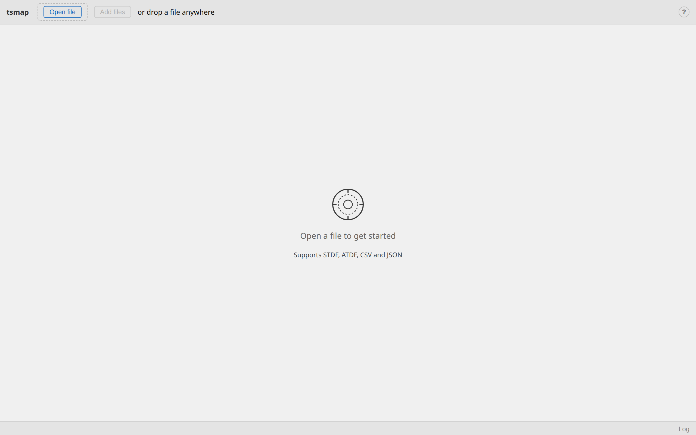
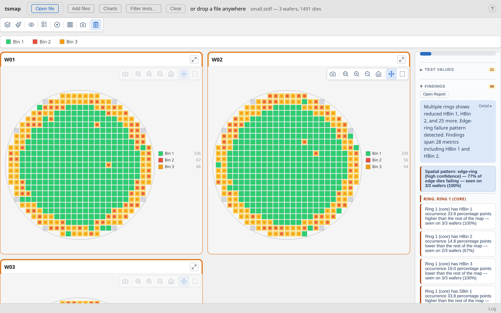
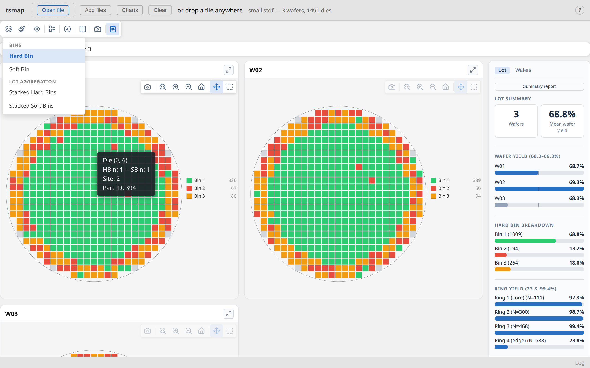
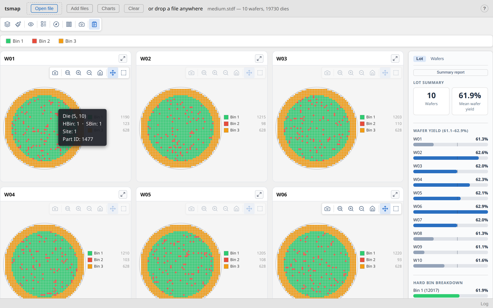

# tsmap User Guide

tsmap loads semiconductor wafer map data from STDF, ATDF, CSV, and JSON files and renders
interactive yield maps, parametric heat maps, and statistical charts. It runs as a native
desktop application on Linux, macOS, and Windows, and as a browser app at
[telecasterer.github.io/tsmap/app/](https://telecasterer.github.io/tsmap/app/).

This guide covers the full workflow: opening files, column mapping, test filtering, reading
maps, and using the charts view.

## 1. Supported file formats

| Format | Extensions | Notes |
|--------|-----------|-------|
| STDF v4 | `.stdf`, `.std` | Binary; PTR (parametric) and FTR (functional) records; multi-wafer lots |
| ATDF | `.atdf`, `.atd` | ASCII equivalent of STDF; same data, same features |
| CSV | `.csv`, `.txt`, `.dat` | Tab, semicolon, and comma auto-detected; wide and long (pivot) formats |
| JSON | `.json` | Flat array of die objects or nested `[{ wafer, results: [{die}] }]` |
| Gzip | `.gz` | Transparent decompression — e.g. `lot.stdf.gz` |
| Zip | `.zip` | All contained files extracted and loaded as a batch |

STDF and ATDF are always parsed natively — never attempt to open them in a text editor
or spreadsheet. CSV and JSON require a [column mapping step](#3-column-mapping-csv-and-json)
before the data is parsed.

---

## 2. Opening files

### Open file

Click **Open file** in the toolbar to open a file picker. You can select one file or
multiple files at once. On the desktop the picker opens a native OS dialog; in the browser
it opens the browser file dialog.

### Drag and drop

Drop one or more files anywhere in the window. This is equivalent to selecting them through
the file picker and is supported on both desktop and browser.

### Adding files to an existing lot

Once a file is loaded, the **Add files** button becomes active. Use it to append additional
wafers to the current gallery. After parsing, you will see a confirmation overlay that
summarises the incoming wafers and warns about structural mismatches (different die count,
different hard bin set, duplicate wafer IDs). Click **Add N wafers** to confirm, or
**Cancel** to keep the current data unchanged.

### Clearing data

Click **Clear** to unload all data and return to the empty state.

### What happens next

After selecting files, what happens depends on the format:

| Format | Next step |
|--------|-----------|
| STDF / ATDF — ≤ 200 tests | Parsed directly; maps render |
| STDF / ATDF — > 200 tests | [Test selector overlay](#4-test-selector-stdf-and-atdf) appears first |
| CSV / JSON | [Column mapping overlay](#3-column-mapping-csv-and-json) appears first |
| Multiple files | [Wafer rename overlay](#21-wafer-rename-overlay) appears before rendering |

### 2.1 Wafer rename overlay

When loading multiple files (or a zip containing multiple files), tsmap shows a rename
overlay listing each wafer with an editable label. The labels are pre-filled from the
file name or the wafer ID in the data. Edit any label that needs changing, then click
**Continue →**.

---

## 3. Column mapping (CSV and JSON)

CSV and JSON files don't have a fixed schema, so tsmap shows a column mapping overlay
before parsing. It lists every column in the file with a dropdown to assign its role.
Common column names (`x`, `hbin`, `result`, `lo_limit`, etc.) are detected automatically
and pre-filled.

### Role reference

| Role | What it means |
|------|--------------|
| **X position** | Die column coordinate (prober step, integer). Required. |
| **Y position** | Die row coordinate (prober step, integer). Required. |
| **Hard bin** | Hard bin number per die |
| **Soft bin** | Soft bin number per die |
| **Wafer ID** | Identifies which wafer each row belongs to; splits rows into separate wafer maps |
| **Lot ID** | Lot identifier shown in the summary panel |
| **Test value** | Numeric test result (wide format — one column per test); the **Test name** field to the right sets the display name for that test |
| **Test name (long format)** | Column containing the test name in a long/pivot layout |
| **Test result (long format)** | Column containing the numeric result in a long/pivot layout |
| **Low limit (long format)** | LSL in a long-format file |
| **High limit (long format)** | USL in a long-format file |
| **Units (long format)** | Units string in a long-format file |
| **Display info** | Additional per-wafer metadata shown in the gallery label; the **Gallery split** checkbox splits the data into separate wafer maps based on unique values in this column |
| **— ignore —** | Column is not imported |

### Wide vs long format

**Wide format** has one column per test (the most common layout from prober exports). Assign
each test column the **Test value** role and fill in the test name.

**Long format** has one row per die per test (each row includes a test name column and a
result column). Assign the **Test name (long format)** and **Test result (long format)**
roles; optionally assign the limit and units columns too. tsmap detects likely long-format
files automatically and shows a prompt if multiple rows share the same X/Y coordinates.

### Pass bins

The **Pass bin(s)** field at the bottom of the overlay specifies which hard bin values are
treated as pass for yield calculation. Default is `1`. Enter multiple bin numbers separated
by commas (e.g. `1,7`).

### Saved mappings

Once you click **Continue →**, the mapping is saved and automatically restored the next
time you open a file with the same set of column names. If the columns have changed, the
overlay re-appears with fresh auto-detection.

---

## 4. Test selector (STDF and ATDF)

STDF and ATDF files from production testers often contain hundreds of parametric and
functional tests. When a file contains more than 200 tests, tsmap shows a test selector
overlay before the full parse so you can choose which tests to import. This keeps memory
usage and load time proportional to what you actually need.

### Controls

- **Search** — Filter the list by test name or test number. Results update as you type.
- **Type filter** — Show all tests, only Parametric (PTR), or only Functional (FTR).
  The count per type is shown on each button.
- **Range select** — Type a numeric range (`1000-1099`) or a name-based range
  (`Idsat_vg1-Idsat_vg5`) in the range input and click **Select range**. Matching tests
  are added to the selection.
- **Select all / Select none** — Apply to the currently visible list (respects any active
  search filter).
- **Shift-click** — Click one checkbox, then Shift-click another to select or deselect
  the entire range between them.

Each test row shows the test number (in dim monospace), the test name, and — where defined
in the file — the units and spec limits.

### Memory advisory

The footer shows how many tests are selected and estimates the memory footprint
(selected tests × total die count):

- **Amber** — large selection; the import will be slow.
- **Red** — very large selection; risk of running out of memory. You'll be asked to
  confirm before the import starts.

If you select no tests, only bin data is imported (bin map is still fully usable).

### After load: re-filtering

After a successful load, the **Filter tests…** button appears in the toolbar. Click it to
re-open the test selector at any time and change which tests are imported. The file is
re-parsed with the new selection — bin and yield data is preserved regardless of which
tests you select.

For multi-file batches, the selector is shown once based on the largest file; the same
selection is applied to all files.

---

## 5. The wafer map view

After parsing, tsmap renders one or more wafer maps. A single-wafer file shows one
full-screen map with the summary panel open by default. A multi-wafer lot shows a gallery.

### 5.1 Interacting with the map

The map is rendered on an interactive canvas. The toolbar appears when you hover over the map.

| Gesture | Action |
|---------|--------|
| Scroll wheel | Zoom in/out centred on the cursor |
| Click and drag | Pan the map |
| Double-click | Reset zoom and pan to fit |

### 5.2 Toolbar

The toolbar sits at the top of the map canvas and is visible on hover.

**Plot mode** — Select what to colour each die by:

| Mode | What it shows |
|------|--------------|
| Hard Bin | Standard pass/fail bin colour map |
| Soft Bin | Software-categorised bin colours |
| Test Value | Continuous colour scale for a parametric test value |

When **Test Value** is selected, a test dropdown appears in the toolbar to pick which
parametric test to display. A **log scale** checkbox also appears for tests with a large
dynamic range.

**Overlays** — Toggle additional visual elements drawn on top of the die grid:

- **Ring boundaries** — Concentric zone rings
- **Quadrant lines** — Cross-hair dividing the wafer into quadrants
- **Die labels** — Bin number printed in each die cell
- **Reticle grid** — Repeating reticle exposure field grid
- **XY indicator** — Compass showing the X/Y axis orientation

**Box select** — Click the select tool, then drag a rectangle across the map to highlight
dies in that region and see a count in the summary panel.

**Expand** (⛶) — Opens the map in a full-screen modal. Press **Esc** to return, or **F**
to toggle true fullscreen within the modal.

**Download PNG** (⤓) — Saves the current map canvas as a PNG. On the desktop this opens a
native save dialog; in the browser the file is saved to your downloads folder.

### 5.3 Summary panel

The summary panel sits on the right side of the map and shows:

- **Yield** — Pass die count / total die count with percentage
- **Bin breakdown** — Count and percentage for each hard and soft bin
- **Parametric summary** — Mean, median, standard deviation, min, and max for each
  loaded test (visible in Test Value plot mode)
- **Spatial findings** — Automatically detected patterns such as failure clusters, edge
  rings, scratch lines, quadrant effects, and reticle effects

Click any finding row to highlight the affected dies on the map and zoom to fit them.

Toggle the summary panel open or closed with the **Summary panel** button in the toolbar.

### 5.4 Gallery (multi-wafer lot)

Multi-wafer lots render as a side-by-side gallery. Each card shows one wafer map with its
own toolbar and wafer ID label.

- **Columns** — Dropdown in the gallery toolbar to control how many wafers appear per row
  (Auto, 1–5 columns).
- Per-card toolbar — Each card has the same Plot mode, Overlays, Expand, and Download
  controls as the single-wafer view.
- The summary panel in gallery mode aggregates findings across all wafers.

---

## 6. Charts view

Click **Charts** in the toolbar to switch to the charts view. Click **← Back to maps** (or
the maps button) to return. Charts and maps share the same parsed data — switching between
them does not re-parse.

The charts view is a two-column grid of panels. Each panel is independent: changing a
dropdown in one panel does not affect others, except that clicking a cell in the correlation
matrix updates the scatter plot's X and Y test selectors.

Every panel has a **Download PNG** (⤓) button and an **Expand** (⛶) button in its header.
The expand modal supports fullscreen (F key) and closes with Esc.

### 6.1 Yield by wafer

Horizontal bar chart showing pass yield per wafer across the lot.

- **Sort** dropdown — Sort bars by yield (descending) or by wafer ID order.
- Click a bar to open that wafer's map.
- Shift-click or Ctrl-click multiple bars to select a group, then click **Open selected**
  to open a filtered view of those wafers.

### 6.2 Bin pareto

Failure count by bin across the entire lot, sorted from most to least frequent.

- **Bins** dropdown — Switch between Hard bins and Soft bins.
- Pass bin appears first and is labelled separately; all other bins are sorted by fail
  count descending.
- Click a bar to highlight dies with that bin.

### 6.3 Test value distribution (boxplot)

Per-wafer five-number summary for one parametric test: minimum, Q1, median, Q3, maximum.

- **Test** dropdown — Select which parametric test to plot.
- **Log scale** checkbox — Switch the value axis to log scale (useful for leakage currents,
  resistance, etc.).
- **Axis includes limits** checkbox — Expand the axis to show the LSL and USL spec limits
  if they are defined in the file.
- Spec limits appear as dashed vertical lines on the plot.
- Click a wafer's box to open that wafer's test value map.
- Hover a row to see the full five-number summary in a tooltip.

### 6.4 Value histogram

Distribution of test values bucketed across the measurement range.

- **Test** dropdown — Select which parametric test to show.
- **Wafer** dropdown — Show data from all wafers combined, or pick one wafer by ID.
- **Axis includes limits** checkbox — Expand the axis to include spec limits.
- Spec limits (LSL/USL) appear as dashed vertical lines if defined.

### 6.5 Test correlation matrix

Pearson correlation coefficient (r) for every pair of parametric tests. Cells are
colour-coded: blue for positive correlation, red for negative; opacity scales with |r|.

- The matrix shows the top N tests ranked by mean |r| across all pairs.
- Hover a cell to see the full test names and the r value to four decimal places.
- Click any off-diagonal cell to instantly update the scatter plot's X and Y tests.
  The grid does not rebuild — scroll position is preserved.
- If the full test count exceeds the matrix size, a label shows how many tests are
  displayed vs. total.

### 6.6 Test correlation scatter

Die-level scatter plot for two parametric tests.

- **X** and **Y** dropdowns — Select which test to plot on each axis.
- **Bin legend** — Hard bin colour swatches above the plot. Click a swatch to filter:
  only dies with that bin are shown at full opacity; others fade. Click again to restore.
  All bins selected = all dies shown.
- Spec limit lines appear as dashed lines on the corresponding axis.
- The correlation matrix's click-cell shortcut updates this panel without rebuilding
  the rest of the charts grid.

---

## 7. Saving and exporting

### PNG export

Every map canvas and chart panel has a **⤓** download button that saves the current view
as a PNG at the displayed resolution.

- **Desktop** — Opens a native save dialog so you can choose a file name and location.
- **Browser** — The PNG is saved directly to your browser's downloads folder.

### Multiple panels

Chart panels can each be exported independently. To get a clean full-resolution render,
use the expand (⛶) button first to open the panel in the fullscreen modal, then click ⤓.

---

## 8. The log panel

A collapsible log panel sits at the bottom of the window. It shows timestamped messages
from the parser and renderer: file load events, parse warnings, and any errors.

- Click **Log** to expand or collapse the panel.
- If any errors occurred, the button label changes to **Log (N errors)** and the panel
  expands automatically.
- Parser warnings (e.g. fabricated soft bin numbers from sentinel values, unrecognised
  records) appear here rather than blocking the load.

---

## 9. Keyboard shortcuts

| Key | Context | Action |
|-----|---------|--------|
| Scroll wheel | Over a wafer map | Zoom in / out |
| Esc | Expand modal (non-fullscreen) | Close modal |
| F | Expand modal | Toggle fullscreen |

---

## 10. Desktop vs browser differences

| Feature | Desktop | Browser |
|---------|---------|---------|
| File parsing | Native Rust (fast, off UI thread) | WASM in a Web Worker (same logic) |
| File picker | Native OS dialog | Browser dialog |
| Drag and drop | Yes | Yes |
| PNG save | Native save dialog | Browser download folder |
| Zip extraction | Native Rust | In-browser (fflate) |
| Offline use | Yes | Yes (once page loaded) |

The browser version is functionally identical to the desktop app. Files are parsed entirely
in your browser — nothing is sent to a server.

Browser requirements: Chrome 80+, Firefox 113+, Safari 16.4+, Edge 80+.
