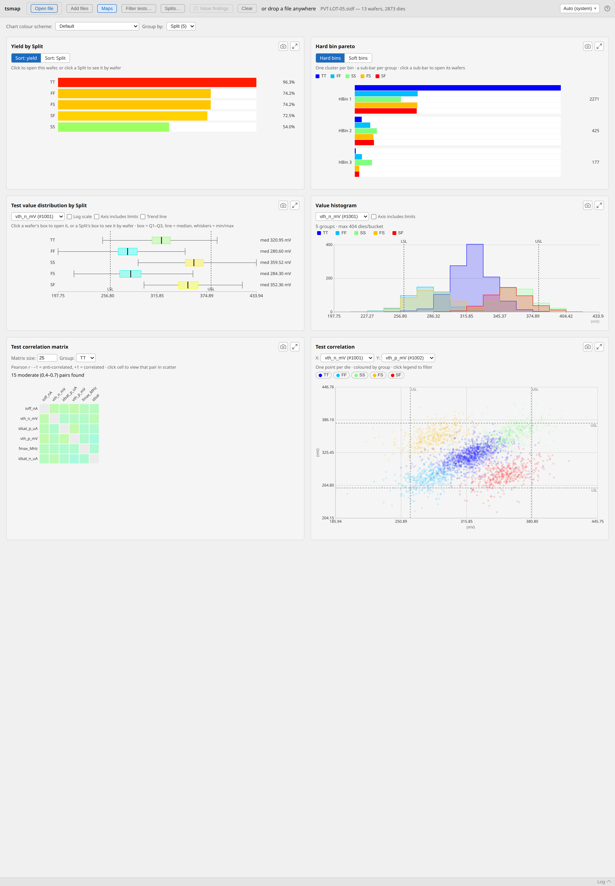
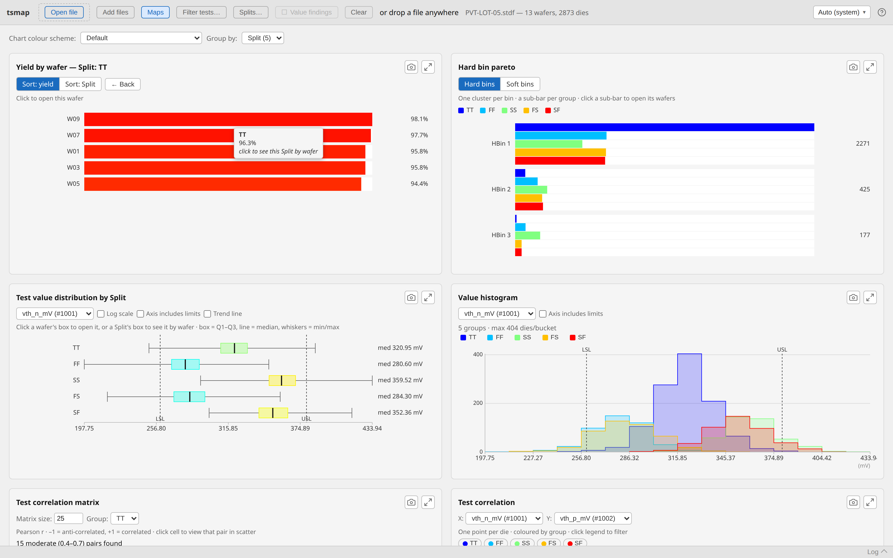

<!-- RENDERER NOTE: this file is processed by two markdown engines.
     marked (scripts/build-user-guide.mjs) → in-app ? modal
     Python-Markdown/pymdownx (zensical)   → docs site
     Rules to avoid divergence:
     - Use 4-space-indented blocks for plain code examples, NOT fenced blocks.
       Fenced blocks require a language tag on the docs site but not in marked.
     - HTML mockup blocks (
) work in both renderers.
     - Test both after structural changes: npm run build:guide && npm run build:site
-->

# tsmap User Guide

tsmap loads semiconductor wafer map data from STDF, ATDF, CSV, and JSON files and renders
interactive yield maps, parametric heat maps, and statistical charts. It runs as a native
desktop application on Linux, macOS, and Windows, and as a browser app at
[telecasterer.github.io/tsmap/app/](https://telecasterer.github.io/tsmap/app/).

This guide covers the full workflow: opening files, column mapping, test filtering, reading
maps, and using the Analysis tab.

## 1. Supported file formats

| Format | Extensions | Notes |
|--------|-----------|-------|
| STDF v4 | `.stdf`, `.std` | Binary; PTR (parametric) and FTR (functional) records; multi-wafer lots |
| ATDF | `.atdf`, `.atd` | ASCII equivalent of STDF; same data, same features |
| CSV | `.csv`, `.txt`, `.dat` | Tab, semicolon, and comma auto-detected; wide and long (pivot) formats |
| JSON | `.json` | Flat array of die objects or nested `[{ wafer, results: [{die}] }]` |
| Gzip | `.gz` | Transparent decompression — e.g. `lot.stdf.gz` |
| Zip | `.zip` | All contained files extracted and loaded as a batch |

STDF and ATDF are always parsed natively — never attempt to open them in a text editor
or spreadsheet. CSV and JSON require a [column mapping step](#3-column-mapping-csv-and-json)
before the data is parsed.

---

## 2. Opening files

### Installing past security warnings

tsmap's installers are not code-signed, so your operating system may warn that the app is
from an unknown or unidentified developer the first time you run it. This is expected — it
reflects the absence of a paid signing certificate, not a problem with the app. The steps
below let you install anyway. If you would rather not install at all, the
[browser version](https://telecasterer.github.io/tsmap/app/) runs with no download.

**Windows** — SmartScreen shows a blue "Windows protected your PC" dialog when you run
`tsmap-<version>-windows-x64.msi` (or the `-setup.exe` installer). Click **More info**, then
**Run anyway**. The warning fades as more people install the app.

**macOS** — Gatekeeper blocks the app with "tsmap can't be opened because it is from an
unidentified developer." After mounting the `.dmg`
(`tsmap-<version>-macos-apple-silicon.dmg` for M-series Macs, `-macos-intel.dmg` for Intel)
and dragging tsmap to Applications, **right-click** the app in Applications and choose
**Open**, then click **Open** in the dialog. You only need to do this once. If macOS instead
says the app is "damaged and can't be opened" — common on Apple Silicon for downloaded
unsigned apps — clear the quarantine flag in Terminal:

    xattr -dr com.apple.quarantine /Applications/tsmap.app

**Linux** — the `.deb`, `.rpm`, and `.AppImage` builds run normally; any warning is just a
browser download nag. For the AppImage, mark it executable first:

    chmod +x tsmap-*-linux-x86_64.AppImage
    ./tsmap-*-linux-x86_64.AppImage

  Open file
  Add files
  <svg viewBox="0 0 24 24" width="14" height="14" fill="none" stroke="currentColor" stroke-width="1.8" stroke-linecap="round" stroke-linejoin="round"><path d="M3 12a9 9 0 1 0 2.64-6.36"/><path d="M3 4v5h5"/><path d="M12 7v5l4 2"/></svg> Recent
  Clear
  
  Auto (system) &#9662;
  <svg viewBox="0 0 24 24" width="16" height="16" fill="none" stroke="currentColor" stroke-width="1.8" stroke-linecap="round" stroke-linejoin="round"><circle cx="12" cy="12" r="10"/><path d="M9.09 9a3 3 0 0 1 5.83 1c0 2-3 3-3 3"/><path d="M12 17h.01"/></svg>

The **colour theme** picker sits at the right end of the toolbar, next to the help button. Choose
Auto to follow your system's light/dark setting, or pick a theme explicitly — Light, Light green,
Solarized Light, High contrast, Dark, Nord, Solarized Dark. Your choice is remembered.

### Open file

Click **Open file** in the toolbar to open a file picker. You can select one file or
multiple files at once. On the desktop the picker opens a native OS dialog; in the browser
it opens the browser file dialog.

### Loading sample data

The empty state has a **Load sample data** button that loads a bundled synthetic lot — 13
wafers across 5 process corners — through the normal load flow (test selector included), so
you can see tsmap working before opening your own files. Available on both desktop and
browser. Its process-corner [splits](#6-wafer-splits) apply automatically, so the loaded
lot is ready to explore with **Group by → Split** right away.

### Drag and drop

Drop one or more files anywhere in the window. This is equivalent to selecting them through
the file picker and is supported on both desktop and browser.

### Recent files

*Desktop only.* The **Recent** button lists the last 8 file sets you've opened, each showing
when it was last loaded (`Today 14:32`, `Yesterday 09:05`, or a date for older entries).
Click an entry to reopen it — this replaces the current view the same way **Open file**
does, so it's not a way to append. Click the **×** next to an entry to remove it from the
list. Recent is available whenever you have history, whether or not a file is currently
loaded — not just from the empty state. Not shown in the browser version, since reopening
requires a native file path that browser file pickers don't provide.

### Adding files to an existing lot

Once a file is loaded, the **Add files** button becomes active. Use it to append additional
wafers to the current gallery — it goes through the same column mapping / test selector /
rename steps as a fresh load, then shows a confirmation dialog before merging into the
current gallery:

  
Add 5 wafers to gallery

  
Current gallery: <strong>13</strong> wafers &nbsp;+&nbsp; Adding: <strong>5</strong> wafers &nbsp;=&nbsp; <strong>18</strong> total

  

    ⚠Die count differs from the existing gallery (avg 221 vs 10,482) — check this is the same product.
  

  

    Cancel
    <button class="btn-primary btn-warn" style="pointer-events:none;">Add anyway</button>
  

The dialog summarises the incoming wafers and warns about structural mismatches (different
die count, different hard bin set, duplicate wafer IDs). With no mismatches, the button
reads **Add to gallery**; if there's a warning to acknowledge, it reads **Add anyway**.
Click **Cancel** to keep the current data unchanged.

### Clearing data

Click **Clear** to unload all data and return to the empty state.

### What happens next

After selecting files, what happens depends on the format:

| Format | Next step |
|--------|-----------|
| STDF / ATDF | [Test selector overlay](#4-test-selector-stdf-and-atdf) always appears first |
| CSV / JSON | [Column mapping overlay](#3-column-mapping-csv-and-json) appears first |
| Multiple files | [Wafer rename overlay](#21-wafer-rename-overlay) appears before rendering |

### 2.1 Wafer rename overlay

  

    Wafer labels
    5 wafers from 2 files
  

  <table class="mapping-table" style="margin:0;">
    <thead><tr><th>Source file</th><th></th><th>Wafer label</th><th>Dies</th></tr></thead>
    <tbody>
      <tr><td class="rename-file">lot_a.stdf</td><td class="rename-arrow">→</td><td><input class="rename-input" value="LOT-A · W01" style="pointer-events:none;" readonly></td><td class="rename-count">2,873 dies</td></tr>
      <tr><td class="rename-file">lot_a.stdf</td><td class="rename-arrow">→</td><td><input class="rename-input" value="LOT-A · W02" style="pointer-events:none;" readonly></td><td class="rename-count">2,873 dies</td></tr>
      <tr><td class="rename-file">lot_b.stdf</td><td class="rename-arrow">→</td><td><input class="rename-input" value="LOT-B · W01" style="pointer-events:none;" readonly></td><td class="rename-count">2,873 dies</td></tr>
    </tbody>
  </table>
  

    <button class="btn-secondary" style="pointer-events:none;">Cancel</button>
    
    <button class="btn-primary" style="pointer-events:none;">Continue →</button>
  

When loading multiple files (or a zip containing multiple files, or a single file whose
only wafer has a generic ID like `W01`), tsmap shows a rename overlay listing each wafer
with an editable label. Labels are pre-filled from whatever identifies the wafer in the
data — a distinctive wafer ID is used as-is; a generic one (`W01`) is combined with the
lot ID (`LOT-A · W01`) so wafers stay distinct within and across lots without you needing
to edit anything; with neither, it falls back to the file name. Edit any label that needs
changing, then click **Continue →**.

---

## 3. Column mapping (CSV and JSON)

  

    Column mapping
    1,768 rows · 5 columns
  

  <table class="mapping-table" style="margin:0;">
    <thead><tr><th>Column</th><th></th><th>Role</th><th>Test name</th><th>Subdivide file</th></tr></thead>
    <tbody>
      <tr><td class="col-name">x</td><td class="col-arrow">→</td><td><select class="mapping-table select" style="background:var(--bg-input);border:1px solid var(--border-mid);color:var(--text-secondary);padding:2px 4px;border-radius:3px;font-size:12px;color-scheme:light dark;"><option>X position</option></select></td><td></td><td></td></tr>
      <tr><td class="col-name">y</td><td class="col-arrow">→</td><td><select style="background:var(--bg-input);border:1px solid var(--border-mid);color:var(--text-secondary);padding:2px 4px;border-radius:3px;font-size:12px;color-scheme:light dark;"><option>Y position</option></select></td><td></td><td></td></tr>
      <tr><td class="col-name">hbin</td><td class="col-arrow">→</td><td><select style="background:var(--bg-input);border:1px solid var(--border-mid);color:var(--text-secondary);padding:2px 4px;border-radius:3px;font-size:12px;color-scheme:light dark;"><option>Hard bin</option></select></td><td></td><td></td></tr>
      <tr><td class="col-name">vt_lin</td><td class="col-arrow">→</td><td><select style="background:var(--bg-input);border:1px solid var(--border-mid);color:var(--text-secondary);padding:2px 4px;border-radius:3px;font-size:12px;color-scheme:light dark;"><option>Test value</option></select></td><td><input class="test-name-input" value="Vt_lin" style="pointer-events:none;" readonly></td><td></td></tr>
      <tr><td class="col-name">site</td><td class="col-arrow">→</td><td><select style="background:var(--bg-input);border:1px solid var(--border-mid);color:var(--text-secondary);padding:2px 4px;border-radius:3px;font-size:12px;color-scheme:light dark;"><option>Test site</option></select></td><td></td><td></td></tr>
    </tbody>
  </table>
  

    <button class="btn-secondary" style="pointer-events:none;">Cancel</button>
    
Pass bin(s): <input value="1" style="pointer-events:none;" readonly>

    <button class="btn-primary" style="pointer-events:none;">Continue →</button>
  

CSV and JSON files don't have a fixed schema, so tsmap shows a column mapping overlay
before parsing. It lists every column in the file with a dropdown to assign its role.
Common column names (`x`, `hbin`, `result`, `lo_limit`, etc.) are detected automatically
and pre-filled.

### Role reference

| Role | What it means |
|------|--------------|
| **X position** | Die column coordinate (prober step, integer). Required. |
| **Y position** | Die row coordinate (prober step, integer). Required. |
| **Hard bin** | Hard bin number per die |
| **Soft bin** | Soft bin number per die |
| **Wafer ID** | Identifies which wafer each row belongs to; splits rows into separate wafer maps |
| **Lot ID** | Lot identifier shown in the summary panel |
| **Test site** | Parallel-test site number for each die (the STDF `site_num` equivalent). Dies from all sites share one wafer map; the site appears in the die hover tooltip and can be used as a chart grouping/colour dimension. Numeric values only. |
| **Test value** | Numeric test result (wide format — one column per test); the **Test name** field to the right sets the display name for that test |
| **Test name (long format)** | Column containing the test name in a long/pivot layout |
| **Test result (long format)** | Column containing the numeric result in a long/pivot layout |
| **Low limit (long format)** | LSL in a long-format file |
| **High limit (long format)** | USL in a long-format file |
| **Units (long format)** | Units string in a long-format file |
| **Display info** | Additional metadata captured for grouping/comparison (and shown in tooltips). The **Subdivide file by this column** checkbox is a structural escape hatch for flat files that pack several wafers into one file with no wafer column — it subdivides the file into one wafer map per distinct value of the column. (Do not use it for parallel-test sites — map those to **Test site** instead.) |
| **— ignore —** | Column is not imported |

### Wide vs long format

**Wide format** has one column per test (the most common layout from prober exports). Assign
each test column the **Test value** role and fill in the test name.

**Long format** has one row per die per test (each row includes a test name column and a
result column). Assign the **Test name (long format)** and **Test result (long format)**
roles; optionally assign the limit and units columns too. tsmap detects likely long-format
files automatically and shows a prompt if multiple rows share the same X/Y coordinates.

Examples:

    Wide format — one column per test:
    x, y, hbin, Vt_lin, Idsat_vg1
    1, 1, 1,    452,    185
    2, 1, 2,    438,    179

    Long format — one row per die per test:
    x, y, hbin, test_name,  result
    1, 1, 1,    Vt_lin,     452
    1, 1, 1,    Idsat_vg1,  185
    2, 1, 2,    Vt_lin,     438
    2, 1, 2,    Idsat_vg1,  179

### Pass bins

The **Pass bin(s)** field at the bottom of the overlay specifies which hard bin values are
treated as pass for yield calculation. Default is `1`. Enter multiple bin numbers separated
by commas (e.g. `1,7`).

### Saved mappings

Once you click **Continue →**, the mapping is saved and automatically restored the next
time you open a file with the same set of column names. If the columns have changed, the
overlay re-appears with fresh auto-detection.

---

## 4. Test selector (STDF and ATDF)

  

    
Select tests to import (124 found)

    <svg viewBox="0 0 24 24" width="16" height="16" fill="none" stroke="currentColor" stroke-width="1.8" stroke-linecap="round" stroke-linejoin="round"><path d="M18 6 6 18"/><path d="m6 6 12 12"/></svg>
  

  

    Search by name or number…
    

      All
      Parametric
      Functional
    

  

  

    e.g. test_005-test_050 or 1000-1099
    Select range
  

  

    Select all
    Select none
  

  

    

      <input type="checkbox" checked style="flex-shrink:0;">
      1000
      Vt_lin
      mV · 350–650
    

    

      <input type="checkbox" checked style="flex-shrink:0;">
      1001
      Idsat_vg1
      µA
    

    

      <input type="checkbox" style="flex-shrink:0;">
      1010
      Ioff_vg1
    

    

      <input type="checkbox" style="flex-shrink:0;">
      1011
      Ioff_vg2
    

  

  

    2 of 124 selected
    

      Save list
      Load list
      Cancel
      <button class="btn-primary" style="pointer-events:none;">Import 2 tests →</button>
    

  

STDF and ATDF files from production testers often contain hundreds of parametric and
functional tests. tsmap always shows a test selector overlay before the full parse so
you can choose which tests to import. This keeps memory usage and load time proportional
to what you actually need.

tsmap uses a two-pass approach: a fast first pass reads only the test record headers
(PTR/FTR) to enumerate all tests and their numbers, names, units, and spec limits —
without accumulating any die data. The selector is built from this scan. The full parse
then runs only for the tests you selected, skipping accumulation for everything else.
For a 25-wafer lot with 500 tests and 10 000 dies per wafer, selecting 20 tests instead
of all 500 reduces the in-memory dataset by roughly 25×.

### Controls

- **Search** — Filter the list by test name or test number. Results update as you type.
- **Type filter** — Show all tests, only Parametric (PTR), or only Functional (FTR).
  The count per type is shown on each button.
- **Range select** — Type a numeric range (`1000-1099`) or a name-based range
  (`Idsat_vg1-Idsat_vg5`) in the range input and click **Select range**. Matching tests
  are added to the selection.
- **Select all / Select none** — Apply to the currently visible list (respects any active
  search filter).
- **Shift-click** — Click one checkbox, then Shift-click another to select or deselect
  the entire range between them.

Each test row shows the test number (in dim monospace), the test name, and — where defined
in the file — the units and spec limits.

### Renaming a test

Click into a test's name to edit it directly — the field looks like plain text until you
hover or focus it. Press **Enter** or click away to commit the new name; press **Esc** to
discard the edit and restore the previous name. Renaming only changes the display name —
nothing in the underlying data file changes — and the new name appears everywhere that test
is shown: the selector, the map tooltip, and chart axis labels. Renames persist across
**Filter tests…** re-opens and are included when you **Save list**.

### Test lists (Save / Load)

The **Save list** and **Load list** buttons let you persist a selection and reuse it across
sessions or files from the same product.

**Saving** writes a plain-text `.csv` file containing every selected test number and its
current display name. **Loading** reads that file back, restores the selection, and applies
any name overrides — so renamed tests stay renamed on reload.

The file format is one test per line:

    # tsmap test list
    # Saved: 2026-06-15T10:00:00.000Z
    1000,Idsat_vg1
    1001,Idsat_vg2
    1010,Vt_lin

- Lines starting with `#` are comments and are ignored on load.
- Each data line is `<test number>,<display name>`. The name field is optional — a line
  with just a number selects that test without overriding its name.
- Delimiters can be comma, semicolon, or whitespace — the parser accepts all three.
- Tests in the file that are not present in the current scan are silently skipped
  (the log panel shows a count of skipped tests).

You can hand-edit a list file to rename tests for display (e.g. `1000,Threshold Voltage`)
without changing anything in the original data file. Those names appear in the selector,
on the map tooltip, and in the chart axis labels.

### Memory advisory

The footer shows how many tests are selected and estimates the memory footprint
(selected tests × total die count):

- **Amber** — large selection (roughly 50 million die×test pairs); the import will be
  slow.
- **Red** — very large selection (roughly 200 million die×test pairs); risk of running
  out of memory. You'll be asked to confirm before the import starts.

  
Large selection — may be slow to load

  
Very large selection — risk of running out of memory

If you select no tests, tsmap asks you to confirm ("No tests selected — only bin data will be loaded. Continue?") before importing — the bin map is still fully usable with no tests selected.

### After load: re-filtering

After a successful load, the **Filter tests…** button appears in the toolbar. Click it to
re-open the test selector at any time and change which tests are imported. The file is
re-parsed with the new selection — bin and yield data is preserved regardless of which
tests you select.

For multi-file batches, the selector is shown once and the same selection is applied to
all files. By default the test list is scanned from the **largest file only** — a fast,
representative default. If a test appears only in a smaller file (so it's missing from the
list), click **Scan all N files** in the selector to re-scan every file and merge the full
test list; your current selection is preserved. The "Filter tests…" dialog offers the same
toggle if you didn't widen the scan at load time.

---

## 5. The wafer map view

After parsing, tsmap renders the wafer map. A single-wafer file shows one full-screen map
with the summary panel open by default; a multi-wafer lot shows a side-by-side gallery.

The map is delivered by the wmap rendering engine. For a full walkthrough of toolbar
controls, plot modes, overlays, zoom and pan, die hover tooltips, findings panel, summary
panel, and gallery controls, click the **?** help button in the map toolbar.

### Value findings

The wafer map's summary panel has a **Findings** list — statistically significant spatial
patterns: regions of the wafer (edge ring, quadrants, clusters, test sites) with unusually
low yield or distinctive bin patterns. These yield and bin findings are fast to compute and
**always on**.

The **Value findings** toolbar control is a **toggle** (shown with a ☐ / ☑ checkbox) that
adds one more category to that same Findings list: regions that read unusually high or low on
a specific *test value*, or fail spec more often there than elsewhere ("the edge ring reads
8% high on VDD_CORE"). This is the **only** thing it changes. It does **not** affect:

- the panel's per-test Min/Mean/Max statistics (always shown),
- test-value maps or stacked value maps,
- the [Analysis tab](#7-analysis-tab) (boxplots, histograms, scatter, correlation — all independent).

Because this regional value pass scales with regions × tests × dies, it is **off by default**
to keep loads fast. The toggle appears once a file with test values is loaded; switch it on
and the maps re-render with the extra findings in the panel — the wafer's data is already in
memory, so this recomputes in place with no reload. Switch it off to remove them. It resets to
off each time you load a new file, and is disabled while the Analysis tab is open (it only
affects the map's summary panel).

---

## 6. Wafer splits

A **split** is a name you assign to a wafer that isn't in the file at all — most commonly a
process corner (`TT`, `FF`, `SS`, `FS`, `SF`), but it can be anything: an experiment
condition, a test-temperature group, anything you want to compare wafers by that your
tester didn't record. Once assigned, splits behave exactly like any other metadata field
in the [Analysis tab's Group by dropdown](#grouping-by-lot-metadata-or-split) — split-vs-split
yield, boxplots, histograms, correlation, and scatter all work immediately with no extra
setup — and they can optionally be shown right on the wafer map/gallery labels too.

Once a file is loaded, click **Splits…** in the toolbar to open the assignment dialog:

  

    Wafer splits (13 wafers)
    <svg viewBox="0 0 24 24" width="15" height="15" fill="none" stroke="currentColor" stroke-width="1.8" stroke-linecap="round" stroke-linejoin="round"><path d="M18 6 6 18"/><path d="m6 6 12 12"/></svg>
  

  

    
Filter by wafer ID or source file…

    <label style="display:flex;align-items:center;gap:6px;font-size:13px;color:var(--text-secondary);margin-bottom:10px;"><input type="checkbox" checked style="pointer-events:none;">Show split in wafer map labels</label>
    

      Select all
      Select none
    

    

      
<input type="checkbox" checked style="pointer-events:none;">W02PVT-LOT-05.stdfFF

      
<input type="checkbox" checked style="pointer-events:none;">W10PVT-LOT-05.stdfFF

      
<input type="checkbox" style="pointer-events:none;">W01PVT-LOT-05.stdf—

    

    

      
Split name (e.g. TT, FF, FS)…

      Assign to selected
      Clear split
      Clear all
    

    

      Save splits…
      Load splits…
    

    

      Changes apply immediately.
      <button class="btn-primary" style="pointer-events:none;">Done</button>
    

  

### 6.1 Assigning splits

Tick the checkbox next to one or more wafers — click to toggle, Shift-click to select a
range, same as the test selector — type a split name (or click one of the chips below the
input to reuse an existing name, avoiding accidental near-duplicates like `TT` vs `tt`),
and click **Assign to selected**. **Clear split** removes the assignment from just the
checked rows; **Clear all** removes every wafer's assignment at once (after a confirmation,
since it's not scoped to your current selection). Every action applies immediately — there
is no separate save step, and **Done** just closes the window.

### 6.2 Showing splits on the wafer map

The **"Show split in wafer map labels"** checkbox (on by default) appends the split, as
`W02 · FF`, wherever a wafer's ID is shown — gallery card headers, the single-wafer view,
the summary panel's Wafer Id row, and drilldown modal titles. Turn it off to see plain
wafer IDs again; the underlying assignments are unchanged either way.

### 6.3 Saving and loading split definitions (CSV)

**Save splits…** writes every wafer's current assignment to a CSV file; **Load splits…**
reads one back and applies it by matching wafer IDs — wafers in the file that aren't in
your currently-loaded set are silently skipped, and a log message reports how many rows
matched. This is the way to prepare a split definition ahead of time (e.g. from a fab's lot
traveler) and apply it after loading the STDF, or to share a known-good corner mapping with
a colleague. The format is a simple two-column CSV:

    # tsmap wafer splits
    # Saved: 2026-07-08T10:40:00.000Z
    waferId,split
    W01,TT
    W02,FF
    W03,TT

- Lines starting with `#` are comments and are ignored on load.
- The header row (`waferId,split`) is optional — tsmap recognises and skips it either way.
- A wafer listed with an empty split value is treated as explicitly unassigned.

### 6.4 Restoring splits automatically

tsmap remembers split assignments per lot ID + wafer ID (plus part type, if present) — the
physical wafer's identity, not the file it arrived in — so re-opening the *same lot* later
restores them without reloading the CSV, even if that lot is split across several files
(for example, one file per test temperature). This restore is never silent: if any
assignment is found for the wafers you just loaded, tsmap logs a message and automatically
opens the Splits dialog so you can see exactly what was restored, edit it, or clear it —
rather than silently changing chart groupings and map labels behind your back.

---

## 7. Analysis tab

Click **Analysis** in the map toolbar to switch from the wafer map/gallery to a grid of
statistical panels; click it again to return. Both the single-wafer view and the gallery
have their own **Analysis** button, so charts are available no matter how many wafers are
loaded — a single-wafer load simply has nothing to group by, so every panel shows that one
wafer's own data. The map and the Analysis tab share the same parsed, in-memory data —
switching between them never re-parses.

Every panel has a **Save PNG** (camera icon) button and an **Expand** (corner-arrows icon)
button in its header. The expand modal can be maximized to fill the window (F key) and
closes with Esc.

The chart colour palette (bars, boxes, histogram buckets, correlation matrix) follows the
same colour scheme picker used by the wafer map itself — it isn't a separate chart-only
setting.

### Grouping by lot, metadata, or split

When more than one distinct value is present for a groupable field — for example you have
loaded **several lots**, test programs, temperatures, dates, or have [assigned wafer
splits](#6-wafer-splits) — a **Group by** dropdown appears at the top of the tab. It lists
every field that actually varies across the loaded wafers, with the number of distinct
values. (With a single wafer loaded there is nothing to vary, so this control doesn't
appear.)

Selecting a field re-expresses the yield, bin, boxplot, histogram, and scatter panels
**per group** (one series/aggregate per lot, program, split, …). Each panel does what makes
sense for its kind:

| Panel | Grouped by a field |
| --- | --- |
| Yield by wafer | One bar per group — the group's pooled (die-weighted) yield |
| Hard bin pareto | Replaced by a clustered bin panel — within each bin, one sub-bar per group, with a legend |
| Process capability | A **Group:** selector restricts the panel to one group at a time |
| Boxplot | One box per group, pooling all that group's dies |
| Histogram | Overlaid colour-coded distributions, one per group, with a clickable legend |
| Correlation matrix | A **Group:** selector picks one group; the matrix is computed for that group alone |
| Scatter | Points coloured by group (instead of by hard bin), with a click-to-filter legend |

Choose **None** to return to the plain per-wafer/whole-lot view.

**Yield and Boxplot drill in-place, not into a modal.** With a group active, clicking a
group's bar or box doesn't open a wafer map — it redraws the *same* panel one level down,
showing that group's individual wafers, with a **← Back** button to return to the group
overview. Only a wafer-level bar/box (whether reached this way, or directly when nothing is
grouped) opens the wafer detail modal. The hint line under the panel title and the hover
tooltip both say which action a click will take. **Hard/clustered bin pareto bars are not
clickable** — they summarise counts across wafers, not a single wafer's data.

Two more deliberate choices are worth noting:

- **Correlation is never pooled across the chosen group.** Combining lots into one matrix
  is misleading — between-lot mean shifts can manufacture or hide correlations that do not
  exist within any single lot. So once you select a **Group by** field, the matrix shows
  one group at a time, picked via the panel's own **Group:** selector. If a group has too
  little variation to compute meaningful correlations, the matrix still renders but its
  cells are blank and the summary reads "No significant correlations found".
- **Scatter has the same blind spot when ungrouped.** With no **Group by** active, points
  are coloured by hard bin only, so a load with several lots or part types plots as one
  undifferentiated cloud — a trend you see there could be a between-group artefact rather
  than a real relationship. Once a **Group by** field is active, scatter colours every point
  by group instead (see the table above) — visually separating the groups is itself the fix.

> Grouping is driven by metadata attached to each wafer at load time, plus any [wafer
> splits](#6-wafer-splits) you've assigned. STDF and ATDF contribute every field present in
> their MIR record — lot, sublot, part type, program, test temperature, test date, tester,
> node, operator, and more; CSV and JSON contribute the lot column plus any columns you
> mapped as metadata. Only fields that actually *vary* across the loaded wafers appear in
> the dropdown, so if everything shares one value (a single uniform lot with no splits
> assigned, or only one wafer loaded) the **Group by** control is hidden.

### 7.1 Yield by wafer

Horizontal bar chart showing pass yield per wafer across the lot.

- **Sort** control — Sort bars by yield (descending) or by wafer/group label.
- Click a bar to open that wafer's map in a pop-up modal. Close the modal (Esc, the close
  button, or click outside it) to return to the Analysis tab exactly where you left it.
- **Grouped:** one bar per group showing the group's pooled, die-weighted yield; clicking a
  group's bar drills in-place into its wafers (see above).

### 7.2 Hard bin pareto

Failure count by bin across the entire lot, sorted from most to least frequent.

- **Bins** control — Switch between Hard bins and Soft bins (ungrouped only).
- Pass bin appears first and is labelled separately; all other bins are sorted by fail
  count descending.
- **Grouped:** replaced by a clustered-bar panel — within each bin, one colour-coded
  sub-bar per group, with a legend. Hover a sub-bar for its count and share of the bin.
  Bars are not clickable in either mode.

### 7.3 Process capability

Cp/Cpk (short-term) and Pp/Ppk (long-term) capability indices for every parametric test
that has both an LSL and a USL defined, normalised so LSL=0/USL=1 and sorted worst-Ppk-first.
Only appears when at least one test in the file has both spec limits set.

- Click a test's box to drive the boxplot and histogram panels below to that same test.
- **Grouped:** a **Group:** selector restricts the panel to one group's dies at a time.

### 7.4 Test value distribution (boxplot)

Per-wafer five-number summary for one parametric test: minimum, Q1, median, Q3, maximum.

- **Test** dropdown — Select which parametric test to plot (or click a capability box above).
- **Log scale** checkbox — Switch the value axis to log scale (useful for leakage currents,
  resistance, etc.).
- **Axis includes limits** checkbox — Expand the axis to show the LSL and USL spec limits
  if they are defined in the file.
- Spec limits appear as dashed vertical lines on the plot.
- Click a wafer's box to open that wafer's test value map in a pop-up modal. Close the modal
  to return to the Analysis tab.
- Hover a row to see the full five-number summary in a tooltip.
- **Grouped:** one box per group, pooling all of that group's dies; clicking a group's box
  drills in-place into its wafers (see above).

### 7.5 Value histogram

Distribution of test values bucketed across the measurement range.

- **Test** dropdown — Select which parametric test to show.
- **Axis includes limits** checkbox — Expand the axis to include spec limits.
- Spec limits (LSL/USL) appear as dashed vertical lines if defined.
- A count (Y) axis with gridlines shows the per-bucket die count.
- **Grouped:** overlaid colour-coded distributions, one per group, sharing the same buckets
  and a numbered Y axis. A legend lists the groups; click one to bring it to the front and
  dim the others (click again to clear). Hover a bucket to see every group's count there.

### 7.6 Test correlation matrix

Pearson correlation coefficient (r) for every pair of parametric tests. Cell colour
encodes correlation **strength** (|r|) using the active chart colour scheme — stronger
correlations appear as a more saturated colour regardless of sign. Positive and negative
correlations of equal strength look equally prominent; sign is shown in the tooltip.

A summary line above the matrix counts strong (|r| ≥ 0.7) and moderate (0.4–0.7) pairs
among the displayed tests, and notes any weak pairs that were hidden.

- Tests are ranked by mean |r| across all pairs so the most strongly correlated tests
  cluster toward the top-left of the matrix.
- Hover a cell to see the full test names, test numbers, and the r value to four decimal
  places.
- Click any off-diagonal cell to instantly update the scatter plot's X and Y tests.
  The panel does not rebuild — scroll position is preserved.
- **Grouped:** a **Group:** dropdown appears in the panel; the matrix is computed for the
  selected group only (never pooled across groups). A group with too little variation shows
  a populated grid with blank cells and "No significant correlations found".

### 7.7 Test correlation scatter

Die-level scatter plot for two parametric tests.

- **X** and **Y** dropdowns — Select which test to plot on each axis.
- **Bin legend** — Hard bin colour swatches above the plot. Click a swatch to filter:
  only dies with that bin are shown at full opacity; others fade. Click again to restore.
  All bins selected = all dies shown.
- Spec limit lines appear as dashed lines on the corresponding axis.
- The correlation matrix's click-cell shortcut updates this panel without rebuilding
  the rest of the grid.
- **Grouped:** points are coloured by group instead of by hard bin, and the legend shows
  the groups; click a group to isolate its dies. This shows whether the groups separate in
  the X/Y plane without pooling them into a single (potentially misleading) statistic.

---

## 8. Exporting charts

Every chart panel has a **camera** button that saves the current view as a PNG at the
displayed resolution. To get a clean full-resolution render, use the expand (corner-arrows)
button first to open the panel in the fullscreen modal, then click the camera button.

Each exported PNG includes a header strip above the chart with the panel title, source
filename, wafer and die counts, the active test name (where applicable), and the time of
export. The live card UI is unchanged — the header appears only in the saved file.

On the desktop, PNG saves open a native save dialog. In the browser, the file goes to your
downloads folder.

For map PNG export, use the **camera** button in the map toolbar — see the wmap help for
details.

---

## 9. The log panel

A collapsible log panel sits at the bottom of the window. It shows timestamped messages
from the parser and renderer: file load events, parse warnings, and any errors.

  
Log (1 error)

  

    
14:32:01 Loaded lot.stdf — 3 wafers, 10 482 dies

    
14:32:01 Soft bin 65535 sentinel — fabricated bin 2 for 14 dies

    
14:32:02 Failed to load bad.stdf: unexpected end of record

  

- Click **Log** to expand or collapse the panel.
- If any errors occurred, the button label changes to **Log (N errors)** and the panel
  expands automatically.
- Parser warnings (e.g. fabricated soft bin numbers from sentinel values, unrecognised
  records) appear here rather than blocking the load.

**Soft bin 65535** is a sentinel value in the STDF spec meaning "no soft bin assigned to
this die". When the parser encounters it, it maps those dies to a fabricated soft bin so
the wafer map can render — the hard bin value is unaffected. The number in the warning
(e.g. "fabricated bin 2 for 14 dies") is the count of dies where this substitution was
applied. If soft bin data is not meaningful for your product, this warning can be ignored.

---

## 10. Desktop vs browser differences

| Feature | Desktop | Browser |
|---------|---------|---------|
| File parsing | Native Rust (fast, off UI thread) | WASM in a Web Worker (same logic) |
| File picker | Native OS dialog | Browser dialog |
| Drag and drop | Yes | Yes |
| PNG save | Native save dialog | Browser download folder |
| Zip extraction | Native Rust | In-browser (fflate) |
| Offline use | Yes | Yes (once page loaded) |

The browser version is functionally identical to the desktop app. Files are parsed entirely
in your browser — nothing is sent to a server.

Browser requirements: Chrome 80+, Firefox 113+, Safari 16.4+, Edge 80+.
